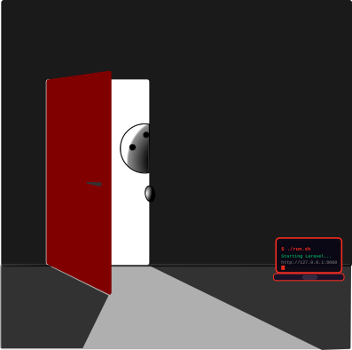

# Portable Laravel

<div align="center">

🇺🇸 [English](#-english) · 🇧🇷 [Brasileiro](#-brasileiro)

</div>

---

<div align="center">
  
</div>

> **Extract. Run. Code.** No installation, no admin rights, no system changes.

Fully self-contained Laravel development environment for **Linux** and **Windows**.
No compilers, no root, no system packages — just `curl` and `tar`.

> **Portaravel** = *Porta* (🇧🇷 door) + *Portable* + *Laravel*

[](LICENSE)

---

<!-- ================================================================== -->
<a id="-english"></a>
## 🇺🇸 English
<!-- ================================================================== -->

## Table of Contents

- [One-liner install & run](#one-liner-install--run)
- [Linux](#linux)
  - [Quick Start](#quick-start)
  - [Building](#building-linux)
  - [Directory Structure](#directory-structure-linux)
  - [Launcher Scripts](#launcher-scripts-linux)
  - [Dev Shell](#dev-shell-linux)
  - [IDE Setup](#ide-setup-linux)
  - [Vite / HMR](#vite--hmr-linux)
  - [Database](#database-linux)
  - [PHP Extensions](#php-extensions-linux)
  - [Troubleshooting](#troubleshooting-linux)
  - [Updating](#updating-linux)
- [Windows](#windows)
  - [Quick Start](#quick-start-1)
  - [Building](#building-windows)
  - [Directory Structure](#directory-structure-windows)
  - [Launcher Scripts](#launcher-scripts-windows)
  - [Dev Shell](#dev-shell-windows)
  - [IDE Setup](#ide-setup-windows)
  - [Vite / HMR](#vite--hmr-windows)
  - [Database](#database-windows)
  - [Xdebug](#xdebug-windows)
  - [Troubleshooting](#troubleshooting-windows)
  - [Updating](#updating-windows)
- [Comparative](#comparative)

---

### One-liner install & run

**Linux:**
```bash
curl -fL --progress-bar https://github.com/ensismoebius/portaravel/releases/latest/download/portable-laravel-linux.tar.gz | tar -xz && cd portable-laravel-linux && ./run.sh
```

**Windows (PowerShell):**
```powershell
irm https://github.com/ensismoebius/portaravel/releases/latest/download/portable-laravel-windows.zip -OutFile pl.zip; Expand-Archive pl.zip -DestinationPath .; cd portable-laravel-windows; .\run.bat
```

---

## Linux

### Quick Start

```bash
chmod +x run.sh
./run.sh
```

Server starts on **http://127.0.0.1:8080** and the browser opens automatically.

---

### Building (Linux)

**Prerequisites** — no compilers needed, no root:

| Tool | Purpose | Install |
|------|---------|---------|
| `curl` | download PHP, Node, Composer | `apt install curl` / `dnf install curl` / `pacman -S curl` |
| `tar` | extract archives | usually pre-installed |
| `gzip` | compression | usually pre-installed |
| `git` | resolve paths | usually pre-installed |

**Clone and run:**

```bash
git clone https://github.com/ensismoebius/portaravel.git
cd portaravel
chmod +x build-linux.sh
./build-linux.sh
```

Downloads everything on first run, caches in `dist/_cache/`. Subsequent runs reuse cache.

**What it does, step by step:**

1. Downloads a pre-built static PHP 8.4 CLI binary (`dl.static-php.dev`) — no compilation
2. Downloads the latest Composer PHAR (`getcomposer.org`)
3. Downloads Node.js 22 LTS tarball (`nodejs.org`)
4. Runs `composer create-project laravel/laravel`
5. Configures `.env` (SQLite, local mode, correct URLs)
6. Runs `npm install` + `npm run build` (Vite production assets)
7. Writes launcher scripts (`run.sh`, `stop.sh`, `shell.sh`, `vite.sh`, …)
8. Packages everything into `dist/portable-laravel-linux.tar.gz`

**Output:**

```
dist/
├── _cache/                          ← downloaded archives (reused on rebuild)
├── portable-laravel-linux/          ← ready-to-use distribution directory
└── portable-laravel-linux.tar.gz    ← distributable archive (~120 MB)
```

**Options:**

```bash
./build-linux.sh --force               # delete dist and rebuild from scratch
./build-linux.sh --skip-package        # skip creating the .tar.gz
./build-linux.sh --include-dev-tools   # also install Telescope, Debugbar, Pest, Rector
./build-linux.sh --dist-dir /tmp/out   # write output to a custom directory
```

---

### Directory Structure (Linux)

```
portable-laravel-linux/
├── php/               Static PHP 8.4.x
│   ├── bin/php        (statically compiled – no system libs required)
│   ├── php.ini        (regenerated at each launch from template)
│   └── php.ini.template
├── composer/
│   └── composer.phar
├── node/              Node.js 22.x LTS
│   ├── bin/node
│   ├── bin/npm
│   └── bin/npx
├── app/               Laravel application
│   ├── .env
│   ├── vendor/
│   ├── node_modules/
│   └── .vscode/
├── database/
│   └── database.sqlite
├── logs/
├── temp/
├── _env.sh            (shared env bootstrap)
├── run.sh             START HERE
├── shell.sh           Dev shell
├── artisan.sh         Artisan wrapper
├── composer.sh        Composer wrapper
├── npm.sh             npm wrapper
├── vite.sh            Vite dev server
└── stop.sh            Stop all processes
```

---

### Launcher Scripts (Linux)

| Script | Purpose |
|--------|---------|
| `run.sh` | Start Laravel + Vite, run migrations, open browser |
| `shell.sh` | Interactive bash with `php`, `composer`, `npm`, `artisan` in PATH |
| `vite.sh` | Standalone Vite HMR server (run alongside `run.sh`) |
| `artisan.sh` | Artisan wrapper |
| `composer.sh` | Composer wrapper |
| `npm.sh` | npm wrapper |
| `stop.sh` | Kill artisan serve (port 8080) and Vite (port 5173) |

```bash
# Custom port
LARAVEL_PORT=9090 ./run.sh

# Two-terminal HMR workflow
./run.sh       # Terminal 1
./vite.sh      # Terminal 2
```

---

### Dev Shell (Linux)

`./shell.sh` drops you into an isolated bash session with all bundled tools wired up — no system PHP, no system Node, no system Composer bleeds in.

**What's available:**

| Command | Resolves to |
|---------|------------|
| `php` | `php/bin/php` (bundled static binary) |
| `composer` | alias → bundled PHP + `composer/composer.phar` |
| `artisan` | alias → bundled PHP + `app/artisan` |
| `npm` | `node/bin/npm` |
| `npx` | `node/bin/npx` |
| `node` | `node/bin/node` |

**Environment pre-set:**

- Working directory: `app/` (Laravel root)
- `DB_DATABASE` → absolute path to `database/database.sqlite`
- `PHPRC` → `php/` (prevents system php.ini from loading)
- `PHP_INI_SCAN_DIR` → empty (no extra ini files)
- `npm_config_cache` / `npm_config_prefix` → isolated inside `temp/`

**Note:** `artisan` and `composer` are bash functions — type them without `.sh`:

```bash
./shell.sh

# scaffold
artisan make:model Post --migration --controller --resource
artisan make:middleware EnsureUserIsAdmin
artisan make:job ProcessPayment
artisan make:event OrderShipped
artisan make:listener SendOrderNotification --event=OrderShipped

# database
artisan migrate
artisan migrate:fresh --seed
artisan db:seed --class=UserSeeder
artisan tinker

# routing & inspection
artisan route:list --except-vendor
artisan config:show database
artisan about

# queues & cache
artisan queue:work
artisan cache:clear
artisan config:clear
artisan view:clear

# packages
composer require spatie/laravel-permission
composer require --dev barryvdh/laravel-debugbar
composer dump-autoload -o

# frontend
npm run dev       # Vite dev server (hot reload)
npm run build     # production assets
npm install some-package
```

Type `exit` to leave the shell. All PATH changes are scoped to the session.

---

### IDE Setup (Linux)

> **Always open the `app/` subfolder** in your IDE — not the distribution root.
> The Laravel project, `.vscode/`, and all source files live there.

```bash
code app/          # VSCode
phpstorm app/      # PHPStorm (if CLI launcher installed)
cursor app/        # Cursor
```

---

#### VSCode / Cursor

`.vscode/` is pre-configured inside `app/`. On first open VSCode will prompt to install recommended extensions.

**Recommended extensions** (from `.vscode/extensions.json`):

| Extension | Purpose |
|-----------|---------|
| `bmewburn.vscode-intelephense-client` | PHP IntelliSense, go-to-definition |
| `xdebug.php-debug` | Xdebug debugger (Windows only) |
| `bradlc.vscode-tailwindcss` | Tailwind CSS IntelliSense |
| `amirmarmul.laravel-blade-vscode` | Blade syntax |
| `mikestead.dotenv` | `.env` syntax |
| `mtxr.sqltools` + `mtxr.sqltools-driver-sqlite` | SQLite GUI browser |
| `dbaeumer.vscode-eslint` | JS/TS linting |
| `esbenp.prettier-vscode` | Code formatting |

**PHP interpreter path for Intelephense** — add to `.vscode/settings.json` if auto-detection fails:

```json
{
    "intelephense.environment.phpExecutable": "/absolute/path/to/portable-laravel-linux/php/bin/php"
}
```

**SQLite database** — pre-configured in `.vscode/settings.json`:
- Open the SQLTools panel → *Laravel SQLite* connection is already there.

---

#### PHPStorm / IntelliJ

1. **Open project:** File → Open → select the `app/` directory
2. **PHP interpreter:**
   Settings → PHP → CLI Interpreters → `+` → **Other Local**
   - PHP executable: `/path/to/portable-laravel-linux/php/bin/php`
   - PHPStorm will detect the version automatically
3. **Composer:**
   Settings → PHP → Composer
   - Execution: *Local*
   - Path to `composer.phar`: `/path/to/portable-laravel-linux/composer/composer.phar`
   - PHP interpreter: select the one configured above
4. **Database:**
   View → Tool Windows → Database → `+` → Data Source → SQLite
   - File: `/path/to/portable-laravel-linux/database/database.sqlite`
5. **Laravel plugin** (optional but recommended):
   Settings → Plugins → search *Laravel* → install *Laravel* by Nikolay Mihalyov

---

#### Neovim (with LSP)

Using [mason.nvim](https://github.com/williamboman/mason.nvim) + `intelephense`:

```lua
-- Point intelephense at the bundled PHP
require("lspconfig").intelephense.setup({
    init_options = {
        globalStoragePath = vim.fn.expand("~/.local/share/intelephense"),
    },
    settings = {
        intelephense = {
            environment = {
                phpVersion = "8.4.0",
                -- optional: restrict include paths to the project
            },
        },
    },
})
```

Set `$PHP_EXECUTABLE` before launching Neovim if needed:

```bash
PHP_EXECUTABLE=/path/to/portable-laravel-linux/php/bin/php nvim app/
```

---

#### Sublime Text

1. Install [LSP](https://packagecontrol.io/packages/LSP) + [LSP-intelephense](https://packagecontrol.io/packages/LSP-intelephense)
2. Open `app/` as a project: Project → Add Folder to Project
3. In LSP settings point `phpExecutable` to `portable-laravel-linux/php/bin/php`

---

### Vite / HMR (Linux)

Production assets are pre-built during the build step (`npm run build`).
Running `vite.sh` writes `public/hot` — Laravel automatically routes to the Vite dev server.
Stopping Vite removes `public/hot` and reverts to pre-built assets.

---

### Database (Linux)

```bash
./artisan.sh migrate
./artisan.sh migrate:fresh --seed
./artisan.sh tinker
sqlite3 database/database.sqlite    # requires system sqlite3
```

`app/.vscode/settings.json` has a pre-configured SQLTools connection.

---

### PHP Extensions (Linux)

Pre-built static binary (musl-linked, runs on any x86_64 Linux):

`bcmath` `bz2` `calendar` `ctype` `curl` `dom` `exif` `fileinfo` `filter` `ftp`
`gd` `gmp` `iconv` `mbstring` `mysqlnd` `openssl` `pcntl` `pdo` `pdo_mysql`
`pdo_sqlite` `pgsql` `pdo_pgsql` `phar` `posix` `session` `redis` `simplexml`
`soap` `sockets` `sqlite3` `tokenizer` `xml` `xmlreader` `xmlwriter` `zip` `zlib` `opcache`

---

### Troubleshooting (Linux)

**Port already in use:**
```bash
LARAVEL_PORT=9090 ./run.sh
```

**PHP binary won't execute:**
```bash
chmod +x php/bin/php
file php/bin/php        # should say "ELF 64-bit … statically linked"
```

**npm / Vite issues:**
```bash
rm -rf app/node_modules
./npm.sh install --prefix app
```

**Composer out of memory:** edit `php/php.ini.template`, increase `memory_limit`.

---

### Updating (Linux)

```bash
# Composer
curl -o composer/composer.phar https://getcomposer.org/composer.phar

# Node.js – download node-vXX.X.X-linux-x64.tar.gz from nodejs.org, extract over node/

# PHP – edit PHP_MINOR in build-linux.sh and re-run with --force
```

---

## Windows

### Quick Start

```
Double-click  run.bat
```

Server starts on **http://127.0.0.1:8080** and the browser opens automatically.

---

### Building (Windows)

**Prerequisites:**

- Windows 10/11 x64
- PowerShell 5.1+ (built into Windows) or PowerShell 7+
- Internet access (all components downloaded automatically)

**Allow script execution** (one-time, if needed):

```powershell
Set-ExecutionPolicy -Scope CurrentUser RemoteSigned
```

**Clone and run:**

```powershell
git clone https://github.com/ensismoebius/portaravel.git
cd portaravel
.\build-windows.ps1
```

**What it downloads:**

1. PHP 8.4 Thread Safe x64 ZIP (`windows.php.net`)
2. Xdebug DLL matching that PHP build (`xdebug.org`)
3. Composer PHAR (`getcomposer.org`)
4. Node.js 22 LTS ZIP (`nodejs.org`)
5. Laravel via `composer create-project`
6. npm dependencies + Vite production build

**Output:**

```
dist\
├── portable-laravel-windows\          ← ready-to-use distribution directory
└── portable-laravel-windows.zip       ← distributable archive
```

---

### Directory Structure (Windows)

```
portable-laravel-windows/
├── php/               PHP 8.4.x Thread Safe x64
│   ├── php.exe
│   ├── php.ini        (regenerated at each launch from template)
│   ├── php.ini.template
│   └── ext/
│       └── php_xdebug.dll
├── composer/
│   └── composer.phar
├── node/              Node.js 22.x LTS
│   ├── node.exe
│   └── npm.cmd
├── app/               Laravel application
│   ├── .env
│   ├── vendor/
│   ├── node_modules/
│   └── .vscode/
├── database/
│   └── database.sqlite
├── logs/
├── temp/
├── _env.bat           (shared env bootstrap)
├── run.bat            START HERE
├── shell.bat          Dev shell
├── artisan.bat        Artisan wrapper
├── composer.bat       Composer wrapper
├── npm.bat            npm wrapper
├── vite.bat           Vite dev server
└── stop.bat           Stop server
```

---

### Launcher Scripts (Windows)

| Script | Purpose |
|--------|---------|
| `run.bat` | Start Laravel + Vite, run migrations, open browser |
| `shell.bat` | CMD with all tools in PATH |
| `vite.bat` | Standalone Vite HMR server |
| `artisan.bat` | Artisan wrapper |
| `composer.bat` | Composer wrapper |
| `npm.bat` | npm wrapper |
| `stop.bat` | Kill server and Vite by port |

---

### Dev Shell (Windows)

`shell.bat` opens a CMD session with all bundled tools in PATH — no system PHP, no system Node, no system Composer bleeds in.

**What's available:**

| Command | Resolves to |
|---------|------------|
| `php` | `php\php.exe` (bundled binary) |
| `composer` | alias → bundled PHP + `composer\composer.phar` |
| `artisan` | alias → bundled PHP + `app\artisan` |
| `npm` | `node\npm.cmd` |
| `npx` | `node\npx.cmd` |
| `node` | `node\node.exe` |

**Environment pre-set:**

- Working directory: `app\` (Laravel root)
- `DB_DATABASE` → absolute path to `database\database.sqlite`
- `PHPRC` → `php\` (prevents system php.ini from loading)
- `npm_config_cache` / `npm_config_prefix` → isolated inside `temp\`

```cmd
shell.bat

REM scaffold
artisan make:model Post --migration --controller --resource
artisan make:middleware EnsureUserIsAdmin
artisan make:job ProcessPayment

REM database
artisan migrate
artisan migrate:fresh --seed
artisan tinker

REM routing & inspection
artisan route:list --except-vendor
artisan config:show database
artisan about

REM packages
composer require spatie/laravel-permission
composer require --dev barryvdh/laravel-debugbar
composer dump-autoload -o

REM frontend
npm run dev
npm run build
npm install some-package
```

Type `exit` to leave the shell.

---

### IDE Setup (Windows)

> **Always open the `app\` subfolder** in your IDE — not the distribution root.
> The Laravel project, `.vscode\`, and all source files live there.

```powershell
code app\          # VSCode
phpstorm app\      # PHPStorm (if CLI launcher installed)
cursor app\        # Cursor
```

---

#### VSCode / Cursor

`.vscode\` is pre-configured inside `app\`. On first open VSCode will prompt to install recommended extensions.

**Recommended extensions** (from `.vscode\extensions.json`):

| Extension | Purpose |
|-----------|---------|
| `bmewburn.vscode-intelephense-client` | PHP IntelliSense, go-to-definition |
| `xdebug.php-debug` | Xdebug debugger (pre-configured on Windows) |
| `bradlc.vscode-tailwindcss` | Tailwind CSS IntelliSense |
| `amirmarmul.laravel-blade-vscode` | Blade syntax |
| `mikestead.dotenv` | `.env` syntax |
| `mtxr.sqltools` + `mtxr.sqltools-driver-sqlite` | SQLite GUI browser |
| `dbaeumer.vscode-eslint` | JS/TS linting |
| `esbenp.prettier-vscode` | Code formatting |

**Xdebug** is pre-configured — press **F5** in VSCode → *Listen for Xdebug*, then open `http://127.0.0.1:8080`.

**PHP interpreter path for Intelephense** — add to `.vscode\settings.json` if auto-detection fails:

```json
{
    "intelephense.environment.phpExecutable": "C:\\path\\to\\portable-laravel-windows\\php\\php.exe"
}
```

**SQLite database** — pre-configured in `.vscode\settings.json`:
- Open the SQLTools panel → *Laravel SQLite* connection is already there.

---

#### PHPStorm / IntelliJ

1. **Open project:** File → Open → select the `app\` directory
2. **PHP interpreter:**
   Settings → PHP → CLI Interpreters → `+` → **Other Local**
   - PHP executable: `C:\path\to\portable-laravel-windows\php\php.exe`
   - PHPStorm will detect version and Xdebug automatically
3. **Composer:**
   Settings → PHP → Composer
   - Execution: *Local*
   - Path to `composer.phar`: `C:\path\to\portable-laravel-windows\composer\composer.phar`
   - PHP interpreter: select the one configured above
4. **Xdebug:**
   Settings → PHP → Debug → Xdebug section → Debug port: **9003**
   Settings → PHP → Servers → `+` → Host: `127.0.0.1`, Port: `8080`
   Click the **phone icon** in the toolbar to start listening.
5. **Database:**
   View → Tool Windows → Database → `+` → Data Source → SQLite
   - File: `C:\path\to\portable-laravel-windows\database\database.sqlite`
6. **Laravel plugin** (optional but recommended):
   Settings → Plugins → search *Laravel* → install *Laravel* by Nikolay Mihalyov

---

#### Neovim (with LSP)

Using [mason.nvim](https://github.com/williamboman/mason.nvim) + `intelephense`:

```lua
require("lspconfig").intelephense.setup({
    settings = {
        intelephense = {
            environment = {
                phpVersion = "8.4.0",
            },
        },
    },
})
```

Launch Neovim pointing at the bundled PHP:

```powershell
$env:PHP_EXECUTABLE = "C:\path\to\portable-laravel-windows\php\php.exe"
nvim app\
```

---

#### Sublime Text

1. Install [LSP](https://packagecontrol.io/packages/LSP) + [LSP-intelephense](https://packagecontrol.io/packages/LSP-intelephense)
2. Open `app\` as a project: Project → Add Folder to Project
3. In LSP settings point `phpExecutable` to `portable-laravel-windows\php\php.exe`

---

### Vite / HMR (Windows)

Production assets are pre-built during the build step (`npm run build`).
Running `vite.bat` writes `public/hot` — Laravel automatically routes to the Vite dev server.
Stopping Vite removes `public/hot` and reverts to pre-built assets.

---

### Database (Windows)

```cmd
artisan.bat migrate
artisan.bat migrate:fresh --seed
artisan.bat tinker
```

`app/.vscode/settings.json` has a pre-configured SQLTools connection.

---

### Xdebug (Windows)

Xdebug is pre-configured (3.4.x).

| Setting | Value |
|---------|-------|
| Mode | develop, debug, profile |
| Port | 9003 |
| Client | 127.0.0.1 |
| IDE key | VSCODE |

**VSCode:** Install *PHP Debug* (`xdebug.php-debug`), open `app/`, press F5 → *Listen for Xdebug*.

**PHPStorm:** Settings → PHP → Debug → port 9003. Add server `127.0.0.1:8080`. Click phone icon.

**Disable for performance:**
```cmd
set XDEBUG_MODE=off && run.bat
```

---

### Troubleshooting (Windows)

**Port already in use:** edit `_env.bat`, change `LARAVEL_PORT=8080`.

**PHP extension not loading:**
```cmd
shell.bat
php -m
```
Check `logs\php_errors.log`.

**Xdebug not connecting:** verify port 9003 not blocked by Windows Firewall.

**npm / Vite issues:**
```cmd
rmdir /s /q app\node_modules
npm.bat install --prefix app
```

**Composer out of memory:** edit `php\php.ini.template`, increase `memory_limit`.

---

### Updating (Windows)

```powershell
# Composer
curl -o composer\composer.phar https://getcomposer.org/composer.phar
```

Node.js — download `node-vXX.X.X-win-x64.zip` from https://nodejs.org, extract over `node\`.

PHP — download PHP TS ZIP from https://windows.php.net/download, extract to `php\`.
Download matching Xdebug DLL from https://xdebug.org, place in `php\ext\php_xdebug.dll`.

---

## Comparative

| | Linux | Windows |
|---|---|---|
| PHP | 8.4.x static binary | 8.4.x Thread Safe x64 |
| PHP source | dl.static-php.dev (pre-built, musl) | windows.php.net |
| Laravel | 13.x | 12.x |
| Composer | latest | latest |
| Node.js LTS | 22.x | 22.x |
| Xdebug | — | 3.4.x |
| Database | SQLite | SQLite |
| Server | `php artisan serve` | `php artisan serve` |
| Build time | ~1–2 min | ~3–5 min |
| Build requires | `curl tar gzip git` | PowerShell 5.1+ |
| Root / admin | not required | not required |
| Arch | x86_64 | x64 |
| PHP linked | fully static (musl) | DLL-based |
| Runs on | any Linux x86_64 distro | Windows 10/11 |

> Linux PHP is musl-linked and carries zero host library dependencies — copy the folder to any x86_64 Linux machine and it runs unchanged.

---

*Linux: `build-linux.sh` · Windows: `build-windows.ps1`*

[🔝 Voltar ao topo / Back to top](#portable-laravel)

---

<!-- ================================================================== -->
<a id="-brasileiro"></a>
## 🇧🇷 Português (Brasil)
<!-- ================================================================== -->

## Índice

- [Instalação e execução em uma linha](#instalação-e-execução-em-uma-linha)
- [Linux](#linux-pt)
  - [Início Rápido](#início-rápido)
  - [Compilando o Projeto](#compilando-o-projeto-linux)
  - [Estrutura de Diretórios](#estrutura-de-diretórios-linux)
  - [Scripts de Inicialização](#scripts-de-inicialização-linux)
  - [Shell de Desenvolvimento](#shell-de-desenvolvimento-linux)
  - [Configuração de IDE](#configuração-de-ide-linux)
  - [Vite / HMR](#vite--hmr-linux-1)
  - [Banco de Dados](#banco-de-dados-linux)
  - [Extensões PHP](#extensões-php-linux)
  - [Resolução de Problemas](#resolução-de-problemas-linux)
  - [Atualizando](#atualizando-linux)
- [Windows](#windows-pt)
  - [Início Rápido](#início-rápido-1)
  - [Compilando o Projeto](#compilando-o-projeto-windows)
  - [Estrutura de Diretórios](#estrutura-de-diretórios-windows)
  - [Scripts de Inicialização](#scripts-de-inicialização-windows)
  - [Shell de Desenvolvimento](#shell-de-desenvolvimento-windows)
  - [Configuração de IDE](#configuração-de-ide-windows)
  - [Vite / HMR](#vite--hmr-windows-1)
  - [Banco de Dados](#banco-de-dados-windows)
  - [Xdebug](#xdebug-windows-1)
  - [Resolução de Problemas](#resolução-de-problemas-windows)
  - [Atualizando](#atualizando-windows)
- [Comparativo](#comparativo)

---

### Instalação e execução em uma linha

**Linux:**
```bash
curl -fL --progress-bar https://github.com/ensismoebius/portaravel/releases/latest/download/portable-laravel-linux.tar.gz | tar -xz && cd portable-laravel-linux && ./run.sh
```

**Windows (PowerShell):**
```powershell
irm https://github.com/ensismoebius/portaravel/releases/latest/download/portable-laravel-windows.zip -OutFile pl.zip; Expand-Archive pl.zip -DestinationPath .; cd portable-laravel-windows; .\run.bat
```

---

<a id="linux-pt"></a>

## Linux

### Início Rápido

```bash
chmod +x run.sh
./run.sh
```

O servidor inicia em **http://127.0.0.1:8080** e o navegador abre automaticamente.

---

### Compilando o Projeto (Linux)

**Pré-requisitos** — sem compiladores, sem root:

| Ferramenta | Finalidade | Instalação |
|-----------|-----------|-----------|
| `curl` | baixar PHP, Node, Composer | `apt install curl` / `dnf install curl` / `pacman -S curl` |
| `tar` | extrair arquivos | geralmente pré-instalado |
| `gzip` | compressão | geralmente pré-instalado |
| `git` | resolver caminhos | geralmente pré-instalado |

**Clone e execute:**

```bash
git clone https://github.com/ensismoebius/portaravel.git
cd portaravel
chmod +x build-linux.sh
./build-linux.sh
```

Na primeira execução tudo é baixado e armazenado em cache em `dist/_cache/`. Execuções seguintes reutilizam o cache.

**O que o script faz, passo a passo:**

1. Baixa um binário PHP 8.4 CLI estático pré-compilado (`dl.static-php.dev`) — sem compilação local
2. Baixa o Composer PHAR mais recente (`getcomposer.org`)
3. Baixa o tarball do Node.js 22 LTS (`nodejs.org`)
4. Executa `composer create-project laravel/laravel`
5. Configura o `.env` (SQLite, modo local, URLs corretas)
6. Executa `npm install` + `npm run build` (assets de produção do Vite)
7. Gera os scripts de inicialização (`run.sh`, `stop.sh`, `shell.sh`, `vite.sh`, …)
8. Empacota tudo em `dist/portable-laravel-linux.tar.gz`

**Resultado:**

```
dist/
├── _cache/                          ← arquivos baixados (reutilizados na reconstrução)
├── portable-laravel-linux/          ← diretório da distribuição pronta para uso
└── portable-laravel-linux.tar.gz    ← arquivo distribuível (~120 MB)
```

**Opções:**

```bash
./build-linux.sh --force               # apaga o dist e reconstrói do zero
./build-linux.sh --skip-package        # não cria o .tar.gz
./build-linux.sh --include-dev-tools   # instala também Telescope, Debugbar, Pest, Rector
./build-linux.sh --dist-dir /tmp/out   # define um diretório de saída personalizado
```

---

### Estrutura de Diretórios (Linux)

```
portable-laravel-linux/
├── php/               PHP 8.4.x estático
│   ├── bin/php        (compilado estaticamente – sem dependências do sistema)
│   ├── php.ini        (regenerado a cada inicialização a partir do template)
│   └── php.ini.template
├── composer/
│   └── composer.phar
├── node/              Node.js 22.x LTS
│   ├── bin/node
│   ├── bin/npm
│   └── bin/npx
├── app/               Aplicação Laravel
│   ├── .env
│   ├── vendor/
│   ├── node_modules/
│   └── .vscode/
├── database/
│   └── database.sqlite
├── logs/
├── temp/
├── _env.sh            (bootstrap de ambiente compartilhado)
├── run.sh             COMECE AQUI
├── shell.sh           Shell de desenvolvimento
├── artisan.sh         Atalho para o Artisan
├── composer.sh        Atalho para o Composer
├── npm.sh             Atalho para o npm
├── vite.sh            Servidor de desenvolvimento Vite
└── stop.sh            Parar todos os processos
```

---

### Scripts de Inicialização (Linux)

| Script | Finalidade |
|--------|-----------|
| `run.sh` | Inicia Laravel + Vite, executa migrações, abre o navegador |
| `shell.sh` | Bash interativo com `php`, `composer`, `npm`, `artisan` no PATH |
| `vite.sh` | Servidor Vite HMR standalone (execute junto com `run.sh`) |
| `artisan.sh` | Atalho para o Artisan |
| `composer.sh` | Atalho para o Composer |
| `npm.sh` | Atalho para o npm |
| `stop.sh` | Encerra artisan serve (porta 8080) e Vite (porta 5173) |

```bash
# Porta personalizada
LARAVEL_PORT=9090 ./run.sh

# Fluxo HMR com dois terminais
./run.sh       # Terminal 1
./vite.sh      # Terminal 2
```

---

### Shell de Desenvolvimento (Linux)

`./shell.sh` abre uma sessão bash isolada com todas as ferramentas do pacote configuradas — sem PHP do sistema, sem Node do sistema, sem Composer do sistema.

**Disponível:**

| Comando | Resolve para |
|---------|-------------|
| `php` | `php/bin/php` (binário estático do pacote) |
| `composer` | alias → PHP do pacote + `composer/composer.phar` |
| `artisan` | alias → PHP do pacote + `app/artisan` |
| `npm` | `node/bin/npm` |
| `npx` | `node/bin/npx` |
| `node` | `node/bin/node` |

**Ambiente pré-configurado:**

- Diretório de trabalho: `app/` (raiz do Laravel)
- `DB_DATABASE` → caminho absoluto para `database/database.sqlite`
- `PHPRC` → `php/` (impede carregamento do php.ini do sistema)
- `PHP_INI_SCAN_DIR` → vazio (sem arquivos ini extras)
- `npm_config_cache` / `npm_config_prefix` → isolados dentro de `temp/`

**Obs.:** `artisan` e `composer` são funções bash — digite sem `.sh`:

```bash
./shell.sh

# scaffolding
artisan make:model Post --migration --controller --resource
artisan make:middleware EnsureUserIsAdmin
artisan make:job ProcessPayment
artisan make:event OrderShipped
artisan make:listener SendOrderNotification --event=OrderShipped

# banco de dados
artisan migrate
artisan migrate:fresh --seed
artisan db:seed --class=UserSeeder
artisan tinker

# rotas e inspeção
artisan route:list --except-vendor
artisan config:show database
artisan about

# filas e cache
artisan queue:work
artisan cache:clear
artisan config:clear
artisan view:clear

# pacotes
composer require spatie/laravel-permission
composer require --dev barryvdh/laravel-debugbar
composer dump-autoload -o

# frontend
npm run dev       # servidor Vite dev (hot reload)
npm run build     # assets de produção
npm install algum-pacote
```

Digite `exit` para sair. Todas as alterações no PATH ficam restritas à sessão.

---

### Configuração de IDE (Linux)

> **Sempre abra a subpasta `app/`** na sua IDE — não a raiz da distribuição.
> O projeto Laravel, o `.vscode/` e todos os arquivos-fonte ficam lá.

```bash
code app/          # VSCode
phpstorm app/      # PHPStorm (se o launcher CLI estiver instalado)
cursor app/        # Cursor
```

---

#### VSCode / Cursor

`.vscode/` está pré-configurado dentro de `app/`. Na primeira abertura, o VSCode sugerirá instalar as extensões recomendadas.

**Extensões recomendadas** (via `.vscode/extensions.json`):

| Extensão | Finalidade |
|----------|-----------|
| `bmewburn.vscode-intelephense-client` | PHP IntelliSense, ir para definição |
| `xdebug.php-debug` | Depurador Xdebug (apenas Windows) |
| `bradlc.vscode-tailwindcss` | Tailwind CSS IntelliSense |
| `amirmarmul.laravel-blade-vscode` | Sintaxe Blade |
| `mikestead.dotenv` | Sintaxe `.env` |
| `mtxr.sqltools` + `mtxr.sqltools-driver-sqlite` | Navegador SQLite visual |
| `dbaeumer.vscode-eslint` | Lint JS/TS |
| `esbenp.prettier-vscode` | Formatação de código |

**Caminho do PHP para o Intelephense** — adicione ao `.vscode/settings.json` se a detecção automática falhar:

```json
{
    "intelephense.environment.phpExecutable": "/caminho/absoluto/para/portable-laravel-linux/php/bin/php"
}
```

**Banco de dados SQLite** — pré-configurado em `.vscode/settings.json`:
- Abra o painel SQLTools → a conexão *Laravel SQLite* já está disponível.

---

#### PHPStorm / IntelliJ

1. **Abrir projeto:** File → Open → selecione o diretório `app/`
2. **Interpretador PHP:**
   Settings → PHP → CLI Interpreters → `+` → **Other Local**
   - PHP executable: `/caminho/para/portable-laravel-linux/php/bin/php`
   - O PHPStorm detecta a versão automaticamente
3. **Composer:**
   Settings → PHP → Composer
   - Execution: *Local*
   - Path to `composer.phar`: `/caminho/para/portable-laravel-linux/composer/composer.phar`
   - PHP interpreter: selecione o configurado acima
4. **Banco de dados:**
   View → Tool Windows → Database → `+` → Data Source → SQLite
   - File: `/caminho/para/portable-laravel-linux/database/database.sqlite`
5. **Plugin Laravel** (opcional, mas recomendado):
   Settings → Plugins → pesquise *Laravel* → instale *Laravel* de Nikolay Mihalyov

---

#### Neovim (com LSP)

Usando [mason.nvim](https://github.com/williamboman/mason.nvim) + `intelephense`:

```lua
require("lspconfig").intelephense.setup({
    settings = {
        intelephense = {
            environment = {
                phpVersion = "8.4.0",
            },
        },
    },
})
```

Se necessário, defina `$PHP_EXECUTABLE` antes de abrir o Neovim:

```bash
PHP_EXECUTABLE=/caminho/para/portable-laravel-linux/php/bin/php nvim app/
```

---

#### Sublime Text

1. Instale [LSP](https://packagecontrol.io/packages/LSP) + [LSP-intelephense](https://packagecontrol.io/packages/LSP-intelephense)
2. Abra `app/` como projeto: Project → Add Folder to Project
3. Nas configurações do LSP, aponte `phpExecutable` para `portable-laravel-linux/php/bin/php`

---

### Vite / HMR (Linux)

Os assets de produção são pré-compilados durante a construção (`npm run build`).
Ao executar `vite.sh`, o arquivo `public/hot` é criado e o Laravel passa automaticamente a usar o servidor de desenvolvimento Vite.
Ao parar o Vite, o arquivo `public/hot` é removido e o Laravel volta a usar os assets pré-compilados.

---

### Banco de Dados (Linux)

```bash
./artisan.sh migrate
./artisan.sh migrate:fresh --seed
./artisan.sh tinker
sqlite3 database/database.sqlite    # requer sqlite3 instalado no sistema
```

O arquivo `app/.vscode/settings.json` possui uma conexão SQLTools pré-configurada.

---

### Extensões PHP (Linux)

Binário estático pré-compilado (linkado com musl, roda em qualquer Linux x86_64):

`bcmath` `bz2` `calendar` `ctype` `curl` `dom` `exif` `fileinfo` `filter` `ftp`
`gd` `gmp` `iconv` `mbstring` `mysqlnd` `openssl` `pcntl` `pdo` `pdo_mysql`
`pdo_sqlite` `pgsql` `pdo_pgsql` `phar` `posix` `session` `redis` `simplexml`
`soap` `sockets` `sqlite3` `tokenizer` `xml` `xmlreader` `xmlwriter` `zip` `zlib` `opcache`

---

### Resolução de Problemas (Linux)

**Porta em uso:**
```bash
LARAVEL_PORT=9090 ./run.sh
```

**Binário PHP não executa:**
```bash
chmod +x php/bin/php
file php/bin/php        # deve exibir "ELF 64-bit … statically linked"
```

**Problemas com npm / Vite:**
```bash
rm -rf app/node_modules
./npm.sh install --prefix app
```

**Composer sem memória:** edite `php/php.ini.template`, aumente o `memory_limit`.

---

### Atualizando (Linux)

```bash
# Composer
curl -o composer/composer.phar https://getcomposer.org/composer.phar

# Node.js – baixe node-vXX.X.X-linux-x64.tar.gz de nodejs.org e extraia sobre node/

# PHP – edite PHP_MINOR em build-linux.sh e execute novamente com --force
```

---

<a id="windows-pt"></a>

## Windows

### Início Rápido

```
Dê dois cliques em  run.bat
```

O servidor inicia em **http://127.0.0.1:8080** e o navegador abre automaticamente.

---

### Compilando o Projeto (Windows)

**Pré-requisitos:**

- Windows 10/11 x64
- PowerShell 5.1+ (já incluso no Windows) ou PowerShell 7+
- Acesso à internet (todos os componentes são baixados automaticamente)

**Permitir execução de scripts** (apenas uma vez, se necessário):

```powershell
Set-ExecutionPolicy -Scope CurrentUser RemoteSigned
```

**Clone e execute:**

```powershell
git clone https://github.com/ensismoebius/portaravel.git
cd portaravel
.\build-windows.ps1
```

**O que é baixado:**

1. PHP 8.4 Thread Safe x64 ZIP (`windows.php.net`)
2. DLL do Xdebug compatível com a versão do PHP (`xdebug.org`)
3. Composer PHAR (`getcomposer.org`)
4. Node.js 22 LTS ZIP (`nodejs.org`)
5. Laravel via `composer create-project`
6. Dependências npm + build de produção do Vite

**Resultado:**

```
dist\
├── portable-laravel-windows\          ← diretório da distribuição pronta para uso
└── portable-laravel-windows.zip       ← arquivo distribuível
```

---

### Estrutura de Diretórios (Windows)

```
portable-laravel-windows/
├── php/               PHP 8.4.x Thread Safe x64
│   ├── php.exe
│   ├── php.ini        (regenerado a cada inicialização a partir do template)
│   ├── php.ini.template
│   └── ext/
│       └── php_xdebug.dll
├── composer/
│   └── composer.phar
├── node/              Node.js 22.x LTS
│   ├── node.exe
│   └── npm.cmd
├── app/               Aplicação Laravel
│   ├── .env
│   ├── vendor/
│   ├── node_modules/
│   └── .vscode/
├── database/
│   └── database.sqlite
├── logs/
├── temp/
├── _env.bat           (bootstrap de ambiente compartilhado)
├── run.bat            COMECE AQUI
├── shell.bat          Shell de desenvolvimento
├── artisan.bat        Atalho para o Artisan
├── composer.bat       Atalho para o Composer
├── npm.bat            Atalho para o npm
├── vite.bat           Servidor de desenvolvimento Vite
└── stop.bat           Parar o servidor
```

---

### Scripts de Inicialização (Windows)

| Script | Finalidade |
|--------|-----------|
| `run.bat` | Inicia Laravel + Vite, executa migrações, abre o navegador |
| `shell.bat` | CMD com todas as ferramentas no PATH |
| `vite.bat` | Servidor Vite HMR standalone |
| `artisan.bat` | Atalho para o Artisan |
| `composer.bat` | Atalho para o Composer |
| `npm.bat` | Atalho para o npm |
| `stop.bat` | Encerra o servidor e o Vite por porta |

---

### Shell de Desenvolvimento (Windows)

`shell.bat` abre uma sessão CMD com todas as ferramentas do pacote no PATH — sem PHP do sistema, sem Node do sistema, sem Composer do sistema.

**Disponível:**

| Comando | Resolve para |
|---------|-------------|
| `php` | `php\php.exe` (binário do pacote) |
| `composer` | alias → PHP do pacote + `composer\composer.phar` |
| `artisan` | alias → PHP do pacote + `app\artisan` |
| `npm` | `node\npm.cmd` |
| `npx` | `node\npx.cmd` |
| `node` | `node\node.exe` |

**Ambiente pré-configurado:**

- Diretório de trabalho: `app\` (raiz do Laravel)
- `DB_DATABASE` → caminho absoluto para `database\database.sqlite`
- `PHPRC` → `php\` (impede carregamento do php.ini do sistema)
- `npm_config_cache` / `npm_config_prefix` → isolados dentro de `temp\`

```cmd
shell.bat

REM scaffolding
artisan make:model Post --migration --controller --resource
artisan make:middleware EnsureUserIsAdmin
artisan make:job ProcessPayment

REM banco de dados
artisan migrate
artisan migrate:fresh --seed
artisan tinker

REM rotas e inspeção
artisan route:list --except-vendor
artisan config:show database
artisan about

REM pacotes
composer require spatie/laravel-permission
composer require --dev barryvdh/laravel-debugbar
composer dump-autoload -o

REM frontend
npm run dev
npm run build
npm install algum-pacote
```

Digite `exit` para sair.

---

### Configuração de IDE (Windows)

> **Sempre abra a subpasta `app\`** na sua IDE — não a raiz da distribuição.
> O projeto Laravel, o `.vscode\` e todos os arquivos-fonte ficam lá.

```powershell
code app\          # VSCode
phpstorm app\      # PHPStorm (se o launcher CLI estiver instalado)
cursor app\        # Cursor
```

---

#### VSCode / Cursor

`.vscode\` está pré-configurado dentro de `app\`. Na primeira abertura, o VSCode sugerirá instalar as extensões recomendadas.

**Extensões recomendadas** (via `.vscode\extensions.json`):

| Extensão | Finalidade |
|----------|-----------|
| `bmewburn.vscode-intelephense-client` | PHP IntelliSense, ir para definição |
| `xdebug.php-debug` | Depurador Xdebug (pré-configurado no Windows) |
| `bradlc.vscode-tailwindcss` | Tailwind CSS IntelliSense |
| `amirmarmul.laravel-blade-vscode` | Sintaxe Blade |
| `mikestead.dotenv` | Sintaxe `.env` |
| `mtxr.sqltools` + `mtxr.sqltools-driver-sqlite` | Navegador SQLite visual |
| `dbaeumer.vscode-eslint` | Lint JS/TS |
| `esbenp.prettier-vscode` | Formatação de código |

**Xdebug** pré-configurado — pressione **F5** no VSCode → *Listen for Xdebug*, depois acesse `http://127.0.0.1:8080`.

**Caminho do PHP para o Intelephense** — adicione ao `.vscode\settings.json` se a detecção automática falhar:

```json
{
    "intelephense.environment.phpExecutable": "C:\\caminho\\para\\portable-laravel-windows\\php\\php.exe"
}
```

**Banco de dados SQLite** — pré-configurado em `.vscode\settings.json`:
- Abra o painel SQLTools → a conexão *Laravel SQLite* já está disponível.

---

#### PHPStorm / IntelliJ

1. **Abrir projeto:** File → Open → selecione o diretório `app\`
2. **Interpretador PHP:**
   Settings → PHP → CLI Interpreters → `+` → **Other Local**
   - PHP executable: `C:\caminho\para\portable-laravel-windows\php\php.exe`
   - O PHPStorm detecta a versão e o Xdebug automaticamente
3. **Composer:**
   Settings → PHP → Composer
   - Execution: *Local*
   - Path to `composer.phar`: `C:\caminho\para\portable-laravel-windows\composer\composer.phar`
   - PHP interpreter: selecione o configurado acima
4. **Xdebug:**
   Settings → PHP → Debug → Xdebug → Debug port: **9003**
   Settings → PHP → Servers → `+` → Host: `127.0.0.1`, Port: `8080`
   Clique no **ícone de telefone** na barra de ferramentas para começar a escutar.
5. **Banco de dados:**
   View → Tool Windows → Database → `+` → Data Source → SQLite
   - File: `C:\caminho\para\portable-laravel-windows\database\database.sqlite`
6. **Plugin Laravel** (opcional, mas recomendado):
   Settings → Plugins → pesquise *Laravel* → instale *Laravel* de Nikolay Mihalyov

---

#### Neovim (com LSP)

Usando [mason.nvim](https://github.com/williamboman/mason.nvim) + `intelephense`:

```lua
require("lspconfig").intelephense.setup({
    settings = {
        intelephense = {
            environment = {
                phpVersion = "8.4.0",
            },
        },
    },
})
```

```powershell
$env:PHP_EXECUTABLE = "C:\caminho\para\portable-laravel-windows\php\php.exe"
nvim app\
```

---

#### Sublime Text

1. Instale [LSP](https://packagecontrol.io/packages/LSP) + [LSP-intelephense](https://packagecontrol.io/packages/LSP-intelephense)
2. Abra `app\` como projeto: Project → Add Folder to Project
3. Nas configurações do LSP, aponte `phpExecutable` para `portable-laravel-windows\php\php.exe`

---

### Vite / HMR (Windows)

Os assets de produção são pré-compilados durante a construção (`npm run build`).
Ao executar `vite.bat`, o arquivo `public/hot` é criado e o Laravel passa automaticamente a usar o servidor de desenvolvimento Vite.
Ao parar o Vite, o arquivo `public/hot` é removido e o Laravel volta a usar os assets pré-compilados.

---

### Banco de Dados (Windows)

```cmd
artisan.bat migrate
artisan.bat migrate:fresh --seed
artisan.bat tinker
```

O arquivo `app/.vscode/settings.json` possui uma conexão SQLTools pré-configurada.

---

### Xdebug (Windows)

Xdebug pré-configurado (3.4.x).

| Configuração | Valor |
|-------------|-------|
| Modo | develop, debug, profile |
| Porta | 9003 |
| Client | 127.0.0.1 |
| IDE key | VSCODE |

**VSCode:** instale o *PHP Debug* (`xdebug.php-debug`), abra a pasta `app/`, pressione F5 → *Listen for Xdebug*.

**PHPStorm:** Configurações → PHP → Debug → porta 9003. Adicione o servidor `127.0.0.1:8080`. Clique no ícone de telefone.

**Desativar para melhor desempenho:**
```cmd
set XDEBUG_MODE=off && run.bat
```

---

### Resolução de Problemas (Windows)

**Porta em uso:** edite `_env.bat`, altere `LARAVEL_PORT=8080`.

**Extensão PHP não carrega:**
```cmd
shell.bat
php -m
```
Verifique `logs\php_errors.log`.

**Xdebug não conecta:** verifique se a porta 9003 não está bloqueada pelo Firewall do Windows.

**Problemas com npm / Vite:**
```cmd
rmdir /s /q app\node_modules
npm.bat install --prefix app
```

**Composer sem memória:** edite `php\php.ini.template`, aumente o `memory_limit`.

---

### Atualizando (Windows)

```powershell
# Composer
curl -o composer\composer.phar https://getcomposer.org/composer.phar
```

Node.js — baixe `node-vXX.X.X-win-x64.zip` de https://nodejs.org e extraia sobre `node\`.

PHP — baixe o ZIP PHP TS de https://windows.php.net/download e extraia para `php\`.
Baixe a DLL correspondente do Xdebug em https://xdebug.org e coloque em `php\ext\php_xdebug.dll`.

---

## Comparativo

| | Linux | Windows |
|---|---|---|
| PHP | Binário estático 8.4.x | 8.4.x Thread Safe x64 |
| Fonte do PHP | dl.static-php.dev (pré-compilado, musl) | windows.php.net |
| Laravel | 13.x | 12.x |
| Composer | mais recente | mais recente |
| Node.js LTS | 22.x | 22.x |
| Xdebug | — | 3.4.x |
| Banco de dados | SQLite | SQLite |
| Servidor | `php artisan serve` | `php artisan serve` |
| Tempo de build | ~1–2 min | ~3–5 min |
| Requisitos de build | `curl tar gzip git` | PowerShell 5.1+ |
| Root / admin | não necessário | não necessário |
| Arquitetura | x86_64 | x64 |
| Linkagem PHP | totalmente estático (musl) | baseado em DLL |
| Roda em | qualquer distro Linux x86_64 | Windows 10/11 |

> O PHP no Linux é linkado com musl e não possui dependências de bibliotecas do sistema host — copie a pasta para qualquer máquina Linux x86_64 e funciona imediatamente.

---

*Linux: `build-linux.sh` · Windows: `build-windows.ps1`*

[🔝 Voltar ao topo / Back to top](#portable-laravel)
